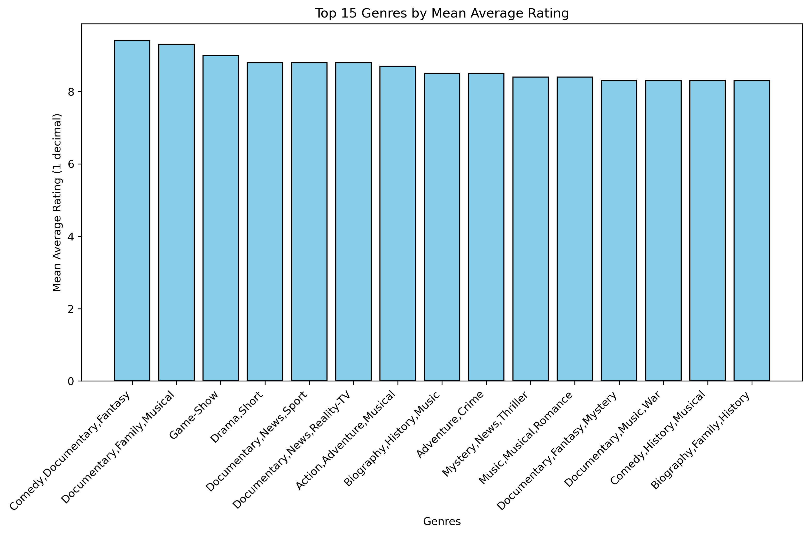
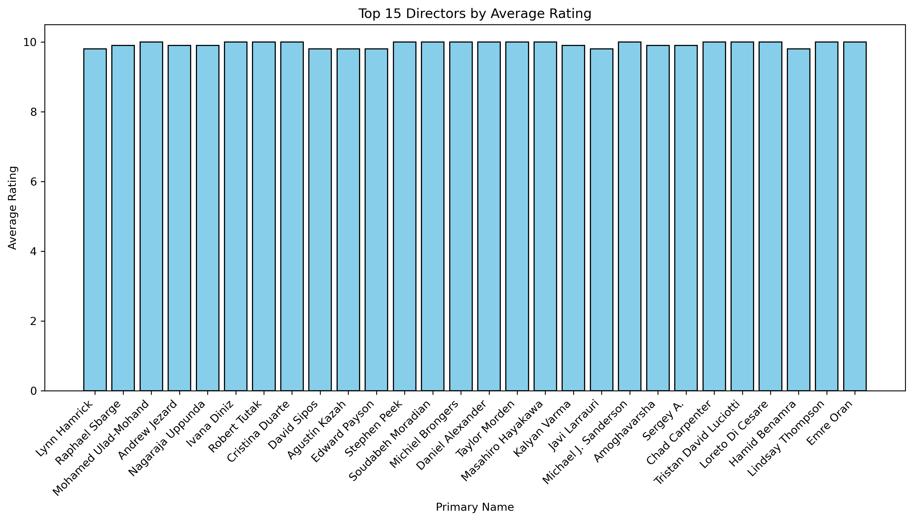
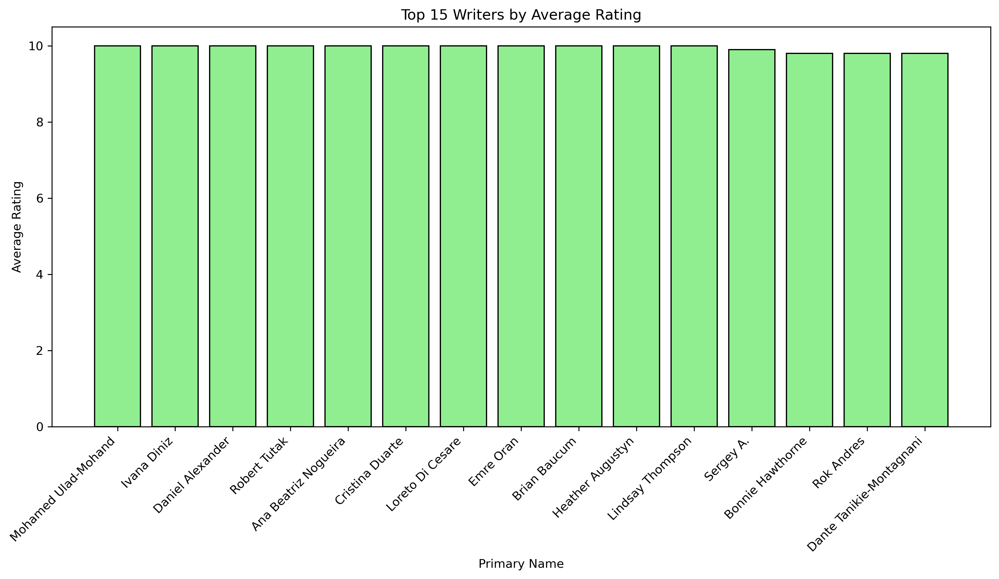

## Phase 2 Final Project 
Group Number: 5
Group Members:

Elizabeth Gichure

Victor Wasuna

June Masolo

Hellen Khisa

Student Pace: Part-time
Instructor: Christine Kirimi

## Business Understanding

* Big Films Business Limited is planning to launch a new movie studio. Since this is a new venture, the company seeks insights on what types of films perform best at the box office.

## Goal:
To provide Big Films Business Limited with a data-driven strategy for selecting film genres, directors, and writers while minimizing risk and maximizing commercial success.

## Objectives:

Identify the best movie genres to produce.

Understand the average runtime per genre.

Highlight top directors and writers with successful track records.

Identify genres with the highest revenue and lowest production costs.

## Data Sources

The project uses datasets from:

Box Office Mojo

IMDB

Rotten Tomatoes

TheMovieDB

The Numbers

## Key tables analyzed:

movie_basics (genres, runtime, titles)

movie_ratings (average ratings, number of votes)

directors & writers (linked to persons)

movie_budgets (production budget, gross earnings)

movie_gross (domestic & foreign gross)

## Data Preparation
data used The following datasets have been used in this project:¶
#### im.db > Used to address objectives 1,2 and 3
#### tn.movie_budgets.csv.gz > Used to address objectives 4

### Importing Libraries

```python
import pandas as pd
import matplotlib.pyplot as plt
import seaborn as sns
import sqlite3
import statsmodels.api as sm
import numpy as np
```
## Selected Tables and columns for analysis
i) Movie_basics
genres
runtime_minutes
movie_id
ii) Movie_rating
averagerating
numvotes
movie_id
iii) Directors
person_id
movie_id
iv) Writers
person_id
movie_id

### We Merged both the movie_ratings table and movie_basics table

```python
query3 = """
SELECT 
    r.movie_id,
    r.averagerating,
    r.numvotes,
    b.primary_title,
    b.runtime_minutes,
    b.genres
FROM movie_ratings r
JOIN movie_basics b
    ON r.movie_id = b.movie_id;
"""
ratings_basics_df = pd.read_sql(query3, conn)
ratings_basics_df.head(4)
```
### Handling Missing Values - ratings_basics_df
To address missing values, we first noticed that the genres column contains many categories.
Instead of filling missing runtimes with a single global value, we grouped the data by genre,
calculated the mean runtime for each genre, and then used those mean to fill the missing values genre by gre.
### Using this method, we successfully filled 6,797 missing runtimes.
After that step, only a small fraction of missing values remained (around 1% of the dataset).
Given how minimal this is, we decided to drop these rows:

runtime_minutes → 823 rows (≈ 1.11%)
genres → 804 rows (≈ 1.09%)
## Objective 1: Best Genres
* We grouped the dataset by genre and averagerating, sorted the results by average rating in descending order, and then selected the top 15 genres with the highest ratings for visualization.
```python
genre_avg = (
    ratings_basics_df
    .groupby("genres")["averagerating"]
    .mean()
    .round(1)
    .reset_index()
    .sort_values(by="averagerating", ascending=False)
)

top_15_genre_ratings = genre_avg.head(15)
top_15_genre_ratings.head()
```
Plotting 

```python
plt.figure(figsize=(12,6))
plt.bar(top_15_genre_ratings["genres"], top_15_genre_ratings["averagerating"], 
        color="skyblue", edgecolor="black")

plt.title("Top 15 Genres by Mean Average Rating")
plt.xlabel("Genres")
plt.ylabel("Mean Average Rating (1 decimal)")
plt.xticks(rotation=45, ha="right")
plt.show()
```
Analyzed average ratings per genre.

Identified genres with the highest votes and popularity.

Visualization: Top 15 genres by rating & votes.




## Objective 2: Average Runtime
We split the genres column into a list of genres for each movie and then used explode to create separate rows for each genre. This allows us to analyze runtime and other metrics by individual genre.
```python
ratings_basics_df['genres'] = ratings_basics_df['genres'].str.split(',')
runtime_df = ratings_basics_df.explode('genres')
runtime_df.head(10)
```
Then calculated mean time per genre 
```python
agg_runtime_df = (
    runtime_df[["genres", "runtime_minutes"]]
    .groupby("genres")
    .agg(average_runtime=('runtime_minutes', 'mean'))  # Named aggregation
    .reset_index()  # Reset index after aggregation
)

# Round the average runtime to whole numbers
agg_runtime_df['average_runtime'] = agg_runtime_df['average_runtime'].round().astype(int)

# Display the resulting DataFrame
agg_runtime_df.head()
agg_runtime_df = agg_runtime_df.sort_values(by = "genres",ascending = True)
agg_runtime_df
```
### Visualization
Ploting the genre verse average runtime


## Objective 3: Best Directors & Writers( check on this )
We retrieved the directors data and selected the top 30 movies by average rating. Then, we grouped the data by person_id and primary_name and calculated the most frequent (mode) average rating for each director. This gives a representative rating per director.
```python
query3 = """
SELECT d.person_id, d.movie_id, p.primary_name, r.averagerating
FROM directors AS d
JOIN persons AS p
    ON p.person_id = d.person_id
JOIN movie_ratings AS r
    ON d.movie_id = r.movie_id;
"""

directors_df = pd.read_sql(query3, conn)
top_directors_df = directors_df.sort_values(by = "averagerating", ascending = False).head(30)
# Group by person_id and primary_name, then get the mode of averagerating
mode_df = (
    top_directors_df
    .groupby(["person_id", "primary_name"])["averagerating"]
    .agg(lambda x: x.mode().iloc[0] if not x.mode().empty else None)
    .reset_index()
)

mode_df.sort_values(by = "averagerating", ascending = False).head(15)
```
### Visualization 
Bar charts of top 15 directors 


### Checking the best film writers
We first read the writers data from the database into a DataFrame called writers_df. Then, we sort the data by averagerating in descending order and select the top 30 rows to focus on the highest-rated writers.

Next, we group the top writers by person_id and primary_name. Within each group, we calculate the mode of averagerating, which gives the most frequently occurring rating for each writer. This ensures that if a writer has multiple entries, we summarize it with their most common rating.
Then we plotted the graph 
# Plot vertical bar chart
```python
plt.figure(figsize=(14,6))
plt.bar(best_writers["primary_name"], best_writers["averagerating"], color="lightgreen", edgecolor="black")
plt.xlabel("Primary Name")
plt.ylabel("Average Rating")
plt.title("Top 15 Writers by Average Rating")
plt.xticks(rotation=45, ha="right")  # Rotate x-axis labels for readability
plt.ylim(0, 10.5)  # Slightly above 10 for better visualization
plt.show()
```



## Objective 4: Revenue vs Budget       
To address this objective, we need the following datasets. The columns used have been listed as well:
#### tn.movie_budgets.csv.gz
Production_budget
domestic_gross

we Cleaned and analyzed production budgets & worldwide gross.
We then Aggregated (get average) the worldwide_Profit by Genre Group
```python
Agg_top_50_worldwide_profit = (
    top_50_worldwide_profit.groupby("Genre", as_index=False)["worldwide_Profit"].mean().round(2)
)

# Convert scientific notation to integers
Agg_top_50_worldwide_profit["worldwide_Profit"] = (
    Agg_top_50_worldwide_profit["worldwide_Profit"].astype("int64")
)

Agg_top_50_worldwide_profit.head()

```
We identified top 50 profitable movies and genres.
we then plotted top 10 genres from Agg_top_50_worldwide_profit

Visualization: Line chart of top 10 genres by profit.


## Modeling – Linear Regression

We modeled the relationship between production budget and worldwide gross.
## Hypothesis 
**Formulate hypothesis:**
**H₀ (null):** There is no linear relationship between production budget and worldwide gross (correlation = 0).

**H₁ (alternative):** There is a linear relationship (correlation ≠ 0).

**Alpha** = 0.05
#### Visualization
**Visualized the relationship:** Created a scatter plot to examine the potential correlation between the two variables
### Building a linear regression model - to quantify the relationship between production budget and Worldwide Gross
Model: Simple Linear Regression
Having 
x = production_budget
y = worldwide_gross
```text 
OLS Regression Results                            
==============================================================================
Dep. Variable:        worldwide_gross   R-squared:                       0.560
Model:                            OLS   Adj. R-squared:                  0.560
Method:                 Least Squares   F-statistic:                     7355.
Date:                Fri, 12 Sep 2025   Prob (F-statistic):               0.00
Time:                        22:57:20   Log-Likelihood:            -1.1557e+05
No. Observations:                5782   AIC:                         2.311e+05
Df Residuals:                    5780   BIC:                         2.311e+05
Df Model:                           1                                         
Covariance Type:            nonrobust                                         
=====================================================================================
                        coef    std err          t      P>|t|      [0.025      0.975]
-------------------------------------------------------------------------------------
const             -7.286e+06   1.91e+06     -3.813      0.000    -1.1e+07   -3.54e+06
production_budget     3.1269      0.036     85.763      0.000       3.055       3.198
==============================================================================
Omnibus:                     4232.022   Durbin-Watson:                   1.005
Prob(Omnibus):                  0.000   Jarque-Bera (JB):           172398.262
Skew:                           3.053   Prob(JB):                         0.00
Kurtosis:                      29.044   Cond. No.                     6.57e+07
===============================================
```
### Equation:
Regression line: y = 3.1269x + -7285667.0546
### The model can be explained as one unit increase in production budget  increases world wide gross by 3.1268 units 

R² = 0.56 → about 56% of variation in worldwide gross is explained by production budget while the other 44% is explained by factors outside the model.
F-statistics of 7355.2, meaning that the model is highly statistically significant. P- value of 0.0 implies extreme significance. An Overwhelming evidence to reject the null hypotheses and conclude that there is a linear relationship between production coast and world wide gross.
## Visualization


## Key Insights

Genres like Action, Adventure, Sci-Fi dominate both ratings and profitability.

Average runtime per genre varies, with most popular films ranging 90–120 minutes.

Several directors and writers consistently deliver high-rated films.

High budgets often lead to higher worldwide grosses, but profitability depends on genre selection.


## Summary of Analysis Done:

### Top 5 Genres:
#### According to average rating:

Comedy,Documentary,Fantasy
Documentary,Family,Musical
Game-Show
Drama,Short
Documentary,News,Sport

#### According to the Number of Votes:

Action, Adventure, Sci-Fi
Action, Adventure, Fantasy
Adventure, Animation, Comedy
Drama
Comedy, Drama, Romance

#### Average movie runtime for 5 randomly selected Genres

Action - 104 minutes
Adult - 87 Minutes
Adventure- 94 minutes
Animation - 85 Minutes
Comedy - 97 Minutes
Top 5 Best Directors
Mohamed Ulad-Mohand
Cristina Duarte
Robert Tutak
Ivana Diniz
Stephen Pee

#### Top 5 Best Writers
Mohamed Ulad-Mohand
Ivana Diniz
Daniel Alexander
Robert Tutak
Ana Beatriz Nogueira

#### Top 5 movie genres that have the highest revenue with low production cost
Drama, Romance, historical/disaster Action, Adventure, Sci-Fi
Action, Crime, Thriller -Animation, Family, Fantasy, Musical
Family, fantasy, Musical, Romance
Hypothesis Testing and Test of Linearity
There is a linear relationship between worldwide gross and production budget

There is a strong, statistically significant predictive relationship between production budget and worldwide gross. The analysis proves correlation, not causation. This could mean that Movies expected to be huge blockbusters (e.g., sure-fire sequels, superhero movies) are given large budgets because studios are confident they will make a lot of money or both high budgets and high grosses are caused by a third factor, like the involvement of A-list directors or stars.